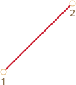
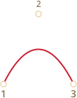
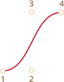

# bezier 曲线

## 什么是 bezier 曲线？

bezier 曲线是法国工程师为雷诺公司车身设计而开发的。

------

### 一阶 bezier

控制点：2

### 二阶 bezier

控制点：3

### 三阶 bezier

控制点：4

------

结论：

1. 并不是所有控制点都在 bezier 曲线上

2. bezier 曲线的阶数等于控制点数减1

3. 曲线总在控制点组成的最小凸多边形内部

> 用于优化图形相交检测

### bezier 曲线生成过程

假设一条由三个控制点生成的 bezier 曲线，生成步骤如下：

1. 首先画出三个控制点

2. 按照 1->2->3 的顺序连成两条线段

3. 定义一个变量 t，并且 t 从 0 到 1 变化。（如：t = 0, 0.05, 0.1, 0.15, 0.2,......0.95, 1）
对于 t 的每个取值：

    * 分别从两条线段取总长度的 t 倍点，得到两个点
    * 连接这两个点，得到一条新线段

4. 对于新得到的线段，同样取线段总长度的 t 倍点

5. 重复步骤 4，直到只生成一个点，这个点即为曲线上的一点。

6. 取下一个 t 值，重复步骤 3，直到 t 为 1，这时就得到 bezier 曲线上所有点，连接这些点就构成 bezier 曲线。

------
对于 四个 控制点，步骤一样。

------
对于 N 个控制点，步骤：

1. 连接控制点生成 N-1 条线段

2. 取 t 从 0 到 1 变化，取每条线段的 t 倍点连接，得到 N-2 条线段

3. 重复步骤 2，直到得到一个点

### 数学公式

* 一阶 bezier

* 二阶 bezier

* 三阶 bezier

## bezier 曲线能做什么？

## 参考文档

* [维基百科](https://zh.wikipedia.org/wiki/%E8%B2%9D%E8%8C%B2%E6%9B%B2%E7%B7%9A)

* [bezier-curve](https://javascript.info/bezier-curve)

* [css-animations](https://javascript.info/css-animations)

* [js-animation](https://javascript.info/js-animation)