---
presentation:
  theme: black.css
  width: 1024
  height: 1200
---

<!-- slide -->

# bezier 曲线

<!-- slide -->

## 什么是 bezier 曲线？

bezier 曲线是法国工程师为雷诺公司车身设计而开发的。

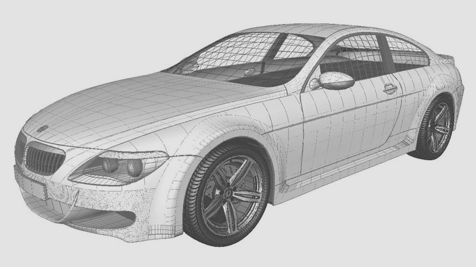

<!-- slide -->

#### 一阶 bezier

控制点：2

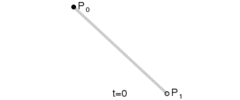

#### 二阶 bezier

控制点：3

#### 三阶 bezier

控制点：4

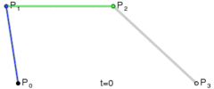

<!-- slide -->

结论：

1. 并不是所有控制点都在 bezier 曲线上

2. bezier 曲线的阶数等于控制点数减1

3. 曲线总在控制点组成的最小凸多边形内部

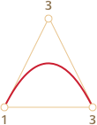

> 用于优化图形相交检测

<!-- slide -->

### bezier 曲线生成过程

假设一条由三个控制点生成的 bezier 曲线，生成步骤如下：

1. 首先画出三个控制点

2. 按照 1->2->3 的顺序连成两条线段

3. 定义一个变量 t，并且 t 从 0 到 1 变化。（如：t = 0, 0.05, 0.1, 0.15, 0.2,......0.95, 1）
对于 t 的每个取值：

    * 分别从两条线段取总长度的 t 倍点，得到两个点
    * 连接这两个点，得到一条新线段

4. 对于新得到的线段，同样取线段总长度的 t 倍点

5. 重复步骤 4，直到只生成一个点，这个点即为曲线上的一点。

6. 取下一个 t 值，重复步骤 3，直到 t 为 1，这时就得到 bezier 曲线上所有点，连接这些点就构成 bezier 曲线。

<!-- slide -->
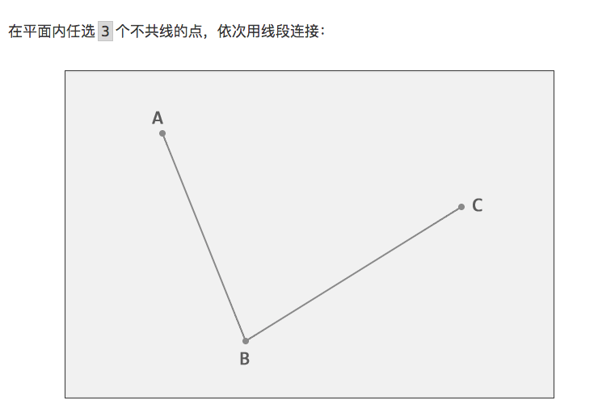
<!-- slide -->
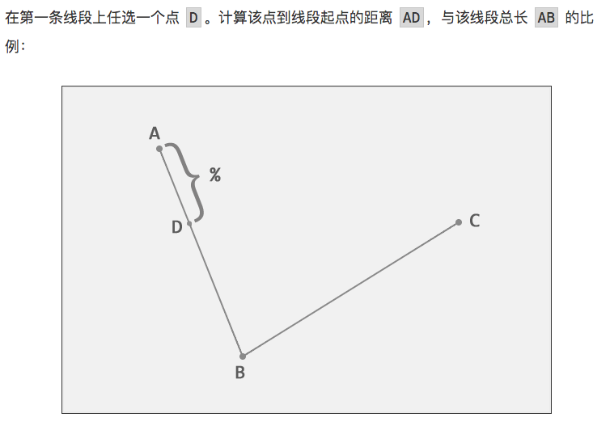
<!-- slide -->
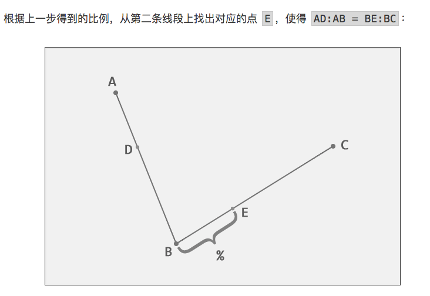
<!-- slide -->
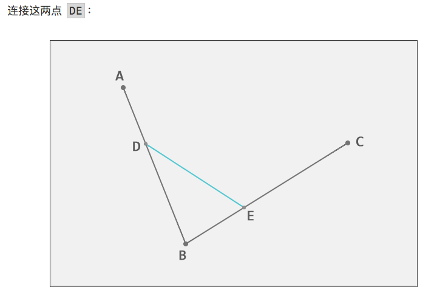
<!-- slide -->
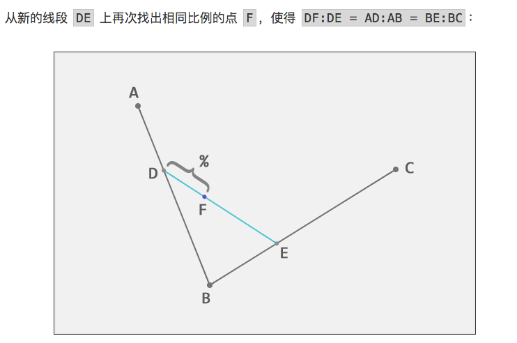
<!-- slide -->
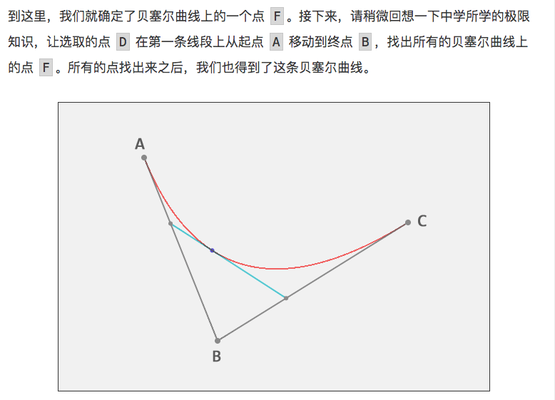
<!-- slide -->
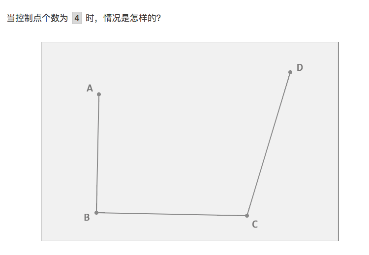
<!-- slide -->
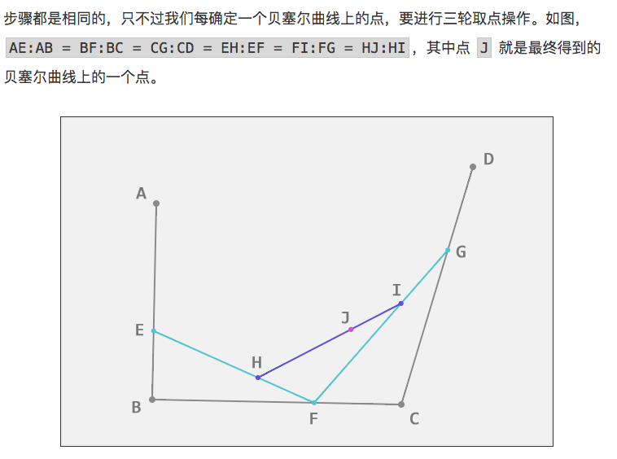
<!-- slide -->
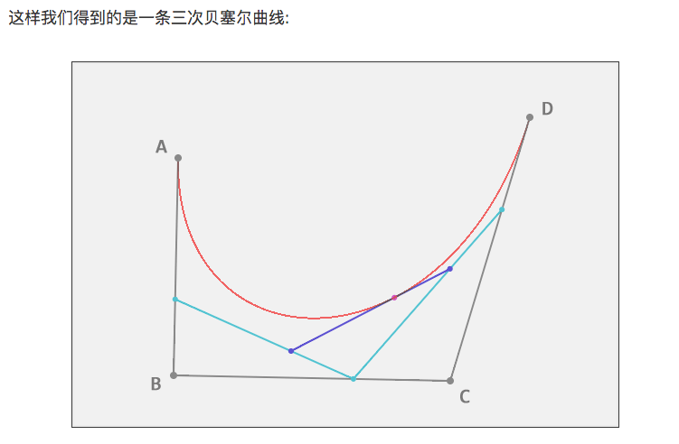
<!-- slide -->

[演示示例](http://192.168.8.159:8080/docs/bezier/bezierMaker.js/example/playground.html)

<!-- slide -->

对于 N 个控制点，步骤：

1. 连接控制点生成 N-1 条线段

2. 取 t 从 0 到 1 变化，取每条线段的 t 倍点连接，得到 N-2 条线段

3. 重复步骤 2，直到得到一个点

<!-- slide -->

### 数学公式

* 一阶 bezier

* 二阶 bezier
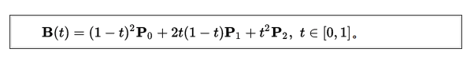

* 三阶 bezier
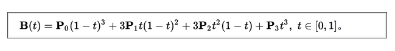

* n阶 bezier
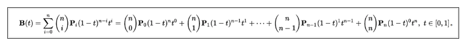

<!-- slide -->

## bezier 曲线在前端的应用

<!-- slide -->

### 绘制优美的曲线

  See the Pen <a href="https://codepen.io/linghuam/pen/VNLMeg/">
  Canvas: 绘制心形</a> by linghuam (<a href="https://codepen.io/linghuam">@linghuam</a>)
  on <a href="https://codepen.io">CodePen</a>.

<!-- slide -->

### 制作不同动效的动画

* css `transition-timing-function` 属性

  See the Pen <a href="https://codepen.io/linghuam/pen/dLoOWL/">
  css动画-transition</a> by linghuam (<a href="https://codepen.io/linghuam">@linghuam</a>)
  on <a href="https://codepen.io">CodePen</a>.

<!-- slide -->

缓动函数
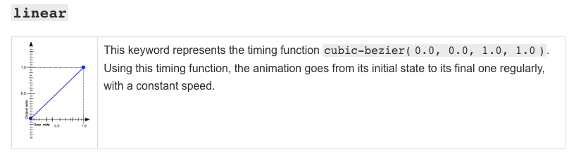
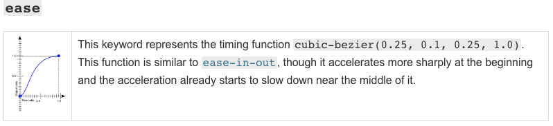
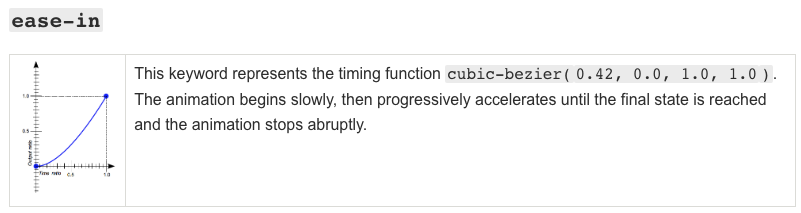
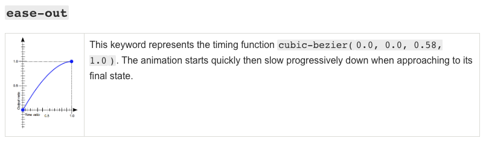
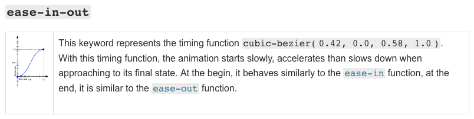

<!-- slide -->

* css `animation-timing-function` 属性

  See the Pen <a href="https://codepen.io/linghuam/pen/GLJEME/">
  css动画-animation</a> by linghuam (<a href="https://codepen.io/linghuam">@linghuam</a>)
  on <a href="https://codepen.io">CodePen</a>.

<!-- slide -->

* TWEEN.js `TWEEN.Easing` 函数

* [时序图示例](http://192.168.8.159:8080/map/timeplay/)

  See the Pen <a href="https://codepen.io/linghuam/pen/zXGzQv/">
  tween-example</a> by linghuam (<a href="https://codepen.io/linghuam">@linghuam</a>)
  on <a href="https://codepen.io">CodePen</a>.

<!-- slide -->

## 参考文档

* [维基百科](https://zh.wikipedia.org/wiki/%E8%B2%9D%E8%8C%B2%E6%9B%B2%E7%B7%9A)

* [bezier-curve](https://javascript.info/bezier-curve)

* [w3cPlus](https://www.w3cplus.com/canvas/drawing-curve.html)

* [css-animations](https://javascript.info/css-animations)

* [js-animation](https://javascript.info/js-animation)