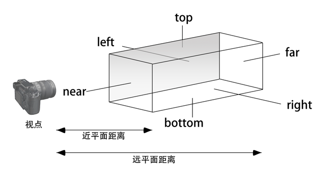
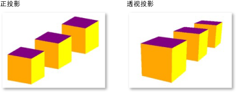

# 知识分享-用 WebGL 绘制一个立方体

## 3D图形是如何绘制出来的？

### 图形硬件知识


GPU采用`流水线结构`，数据从一个阶段传送到下一阶段。

#### 帧缓存

- 图形数据通过 GPU 流水线传送后，最后写入到帧缓存中。
- `帧缓存`是一个存储器，保存了最终要显示到屏幕上的全部图像信息。
  - `颜色缓存：` 以 RGB 或 RGBA 格式保存屏幕上每个像素的颜色。
  - `深度缓存：` 三维场景中的物体存在遮挡情况，深度缓存存储离观察者最近图元的距离。
  - `模板缓存：` 控制在颜色缓存的某个位置写入操作，如处理阴影。

#### 视频生成器

以一定频率逐行扫描颜色缓存，并更新屏幕上的显示内容。对于LCD显示器，更新频率每秒60次。

### WebGL 图形流水线


1. `顶点着色器：`计算顶点位置。

2. `图元装配：`顶点构成点、线、三角形等几何体，并进行裁剪。

3. `光栅化：`将几何图元转换为屏幕像素。

4. `片段着色器：`片段着色。

5. `其他处理：`效果处理。

## 绘制步骤

1. 准备 WebGL 上下文

2. 创建顶点着色器和片段着色器

3. 编译着色器

4. 创建程序对象和链接着色器

5. 建立缓冲

6. 绘制场景

### 第一步：准备 WebGL 上下文

```html
<!-- index.html -->
<canvas id="glcanvas" width="640" height="480"></canvas>
```

```js
// index.js
const canvas = document.getElementById("glcanvas");
const gl = canvas.getContext("webgl");
```

### 第二步：创建顶点着色器和片段着色器

```html
<!-- index.html -->

<!-- 顶点着色器 -->
<script id="vs" type="x-shader/x-vertex">
    attribute vec4 aVertexPosition;

    uniform mat4 uModelViewMatrix;
    uniform mat4 uProjectionMatrix;

    void main() {
        gl_Position = uProjectionMatrix * uModelViewMatrix * aVertexPosition;
    }
</script>

<!-- 片段着色器 -->
<script id="fs" type="x-shader/x-fragment">
    void main() {
        gl_FragColor = vec4(1.0, 1.0, 1.0, 1.0);
    }
</script>
```

`着色器：`用 GLSL 编写的程序，负责记录像素点的位置和颜色。

`顶点着色器：`每次渲染一个形状时，顶点着色器会在形状中每个顶点运行一次。它的作用是将原始顶点从原始坐标系转换到 WebGL 使用的空间坐标系。

`片段着色器：`在顶点着色器处理完顶点位置后，对图形每个像素点调用一次，作用是确定每个像素的颜色。

### 第三步：编译着色器

```js
// 创建指定类型的着色器，上传 source 源码并编译
// type可以取： gl.VERTEX_SHADER gl.FRAGMENT_SHADER
function loadShader(gl, type, source) {
    // 创建着色器对象
    const shader = gl.createShader(type);

    // 将源码载入到着色器对象中
    gl.shaderSource(shader, source);

    // 编译着色器程序
    gl.compileShader(shader);

    // 检查编译状态
    if (!gl.getShaderParameter(shader, gl.COMPILE_STATUS)) {
        alert('An error ocurred compiling the shaders:' + gl.getShaderInfoLog(shader));
        gl.deleteShader(shader);
        return null;
    }
    return shader;
}
```

### 第四步：创建程序对象和链接着色器

```js
function initShaderProgram(gl, vsSource, fsSource) {
    const vertexShader = loadShader(gl, gl.VERTEX_SHADER, vsSource);
    const fragmentShader = loadShader(gl, gl.FRAGMENT_SHADER, fsSource);

    // 创建着色器程序
    const shaderProgram = gl.createProgram();

    // 将顶点着色器和片段着色器附加到程序对象中
    gl.attachShader(shaderProgram, vertexShader);
    gl.attachShader(shaderProgram, fragmentShader);

    // 执行链接操作
    gl.linkProgram(shaderProgram);

    // 创建失败
    if (!gl.getProgramParameter(shaderProgram, gl.LINK_STATUS)) {
        alert('Unable to initialize the shader program:' + gl.getProgramInfoLog(shaderProgram));
        return null;
    }

    // 链接成功，就返回一个程序对象
    // 然后可以用 gl.useProgram() 方法告诉 WebGL 引擎用这个程序对象绘制图形。
    return shaderProgram;
}
```

### 第五步：建立缓冲（准备数据）

```js
function initBuffers {
    const positionBuffer = gl.createBuffer();
    gl.bindBuffer(gl.ARRAY_BUFFER, positionBuffer);

    const positions = [
        // 前面
        -1.0, -1.0,  1.0,
        1.0, -1.0,  1.0,
        1.0,  1.0,  1.0,
        -1.0,  1.0,  1.0,

        // 后面
        -1.0, -1.0, -1.0,
        -1.0,  1.0, -1.0,
        1.0,  1.0, -1.0,
        1.0, -1.0, -1.0,

        // 上面
        -1.0,  1.0, -1.0,
        -1.0,  1.0,  1.0,
        1.0,  1.0,  1.0,
        1.0,  1.0, -1.0,

        // 下面
        -1.0, -1.0, -1.0,
        1.0, -1.0, -1.0,
        1.0, -1.0,  1.0,
        -1.0, -1.0,  1.0,

        // 右面
        1.0, -1.0, -1.0,
        1.0,  1.0, -1.0,
        1.0,  1.0,  1.0,
        1.0, -1.0,  1.0,

        // 左面
        -1.0, -1.0, -1.0,
        -1.0, -1.0,  1.0,
        -1.0,  1.0,  1.0,
        -1.0,  1.0, -1.0
    ];

    gl.bufferData(gl.ARRAY_BUFFER, new Float32Array(positions), gl.STATIC_DRAW);
}
```

### 第六步：绘制场景

```js
function drawScene(gl, programInfo, buffers) {
    // 清除缓存
    gl.clearColor(0, 0, 0, 1.0);
    gl.clearDepth(1.0);
    gl.enable(gl.DEPTH_TEST);
    gl.depthFunc(gl.LEQUAL);
    gl.clear(gl.COLOR_BUFFER_BIT | gl.DEPTH_BUFFER_BIT);

    // 透视投影相机
    const fieldOfview = 45 * Math.PI / 180;
    const aspect = gl.canvas.clientWidth / gl.canvas.clientHeight;
    const zNear = 0.1;
    const zFar = 100.0;
    const projectionMatrix = mat4.create();
    mat4.perspective(projectionMatrix, fieldOfview, aspect, zNear, zFar);

    // 创建模型视图矩阵
    const modelViewMatrix = mat4.create();
    mat4.translate(modelViewMatrix, modelViewMatrix, [0.0, 0.0, -6.0]);

    // 给着色器传入顶点属性
    {
        const numComponents = 3;
        const type = gl.FLOAT;
        const normalize = false;
        const stride = 0;
        const offset = 0;
        gl.bindBuffer(gl.ARRAY_BUFFER, buffers.position);
        gl.vertexAttribPointer(programInfo.attribLocations.vertexPosition, numComponents, type,normalize, stride, offset);
        gl.enableVertexAttribArray(programInfo.attribLocations.vertexPosition);
    }

    // 使用着色器程序绘图
    gl.useProgram(programInfo.program);

    // 设置 shader 常量
    gl.uniformMatrix4fv(programInfo.uniformLocations.projectionMatrix, false, projectionMatrix);
    gl.uniformMatrix4fv(programInfo.uniformLocations.modelViewMatrix, false, modelViewMatrix);

    {
        const offset = 0;
        const vertexCount = 4;
        // 调用 drawArrays 完成绘制
        gl.drawArrays(gl.TRIANGLE_STRIP, offset, vertexCount);
    }
}
```

#### 世界坐标系


右手法则：


#### 变换


1. `模型变换：`(定位对象)实体模型在世界坐标系中的位置和方向。对实体模型本身进行`平移、旋转、缩放`操作。

2. `视图变换：`(对准相机)模型对象在照相机中的位置和方向。WebGL 只对照相机能够看到的对象进行绘制。

3. `模型视图变换：`模型变换和视图变换的合并。

4. `投影变换：`(选择相机镜头)正交投影和透视投影。

5. `归一化：`顶点经过透视除法，将所有坐标转换成归一化设备坐标。

6. `视口坐标：`归一化设备坐标转换成窗口坐标。

#### 相机

1. 透视摄像机：近大远小。

2. 正交摄像机：等比例投影。

透视相机原理图：


正交相机原理图：



对比效果图：



## 参考资料

- [WebGL 高级编程](https://book.douban.com/subject/25750362/)
- [WebGL Tutorial](https://developer.mozilla.org/zh-CN/docs/Web/API/WebGL_API/Tutorial)
- [WebGL MDN](https://developer.mozilla.org/zh-CN/docs/Web/API/WebGL_API/Tutorial/Creating_3D_objects_using_WebGL)